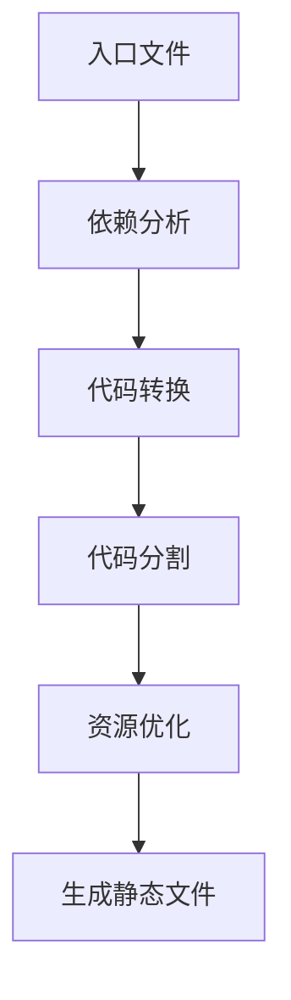

# Vite 实现原理详解

<div style="padding: 2rem; border-radius: 1.5rem; box-shadow: 0.5rem 0.5rem 1rem rgba(0, 0, 0, 0.1), -0.5rem -0.5rem 1rem rgba(255, 255, 255, 0.5); background: linear-gradient(145deg, #f0f0f0, #e6e6e6); margin-bottom: 2rem;">
  <h2 style="color: #333; text-shadow: 1px 1px 2px rgba(255,255,255,0.8);">🚀 Vite 核心理念</h2>
  <p>Vite（法语中的"快速"之意）是一个面向现代浏览器的构建工具，利用浏览器原生 ES 模块特性和 esbuild 提供的极速构建性能，成为当下最受欢迎的前端开发工具之一。</p>
</div>

## 📚 目录

1. [开发服务器原理](#开发服务器原理)
2. [热模块替换(HMR)机制](#热模块替换机制)
3. [按需编译策略](#按需编译策略)
4. [生产构建流程](#生产构建流程)
5. [插件系统实现](#插件系统实现)
6. [依赖预构建](#依赖预构建)

<div style="padding: 2rem; border-radius: 1.5rem; box-shadow: 0.5rem 0.5rem 1rem rgba(0, 0, 0, 0.1), -0.5rem -0.5rem 1rem rgba(255, 255, 255, 0.5); background: linear-gradient(145deg, #f0f0f0, #e6e6e6); margin-bottom: 2rem; margin-top: 2rem;">
  <h2 id="开发服务器原理" style="color: #333; text-shadow: 1px 1px 2px rgba(255,255,255,0.8);">💻 开发服务器原理</h2>
</div>

Vite 的开发服务器基于原生 ES 模块，利用浏览器自身的导入能力，而非传统的打包方式。

### 原生 ESM 加载

```javascript
// 浏览器请求
import { createApp } from '/node_modules/vue/dist/vue.esm-browser.js'
import App from '/src/App.vue'
```

Vite 的开发服务器会拦截这些请求并进行以下处理:

1. **路径重写**: 将模块导入路径转换为真实路径
2. **模块转换**: 对非 JS 文件进行即时编译
3. **缓存处理**: 利用 HTTP 缓存优化性能

### 主要实现步骤

1. 创建一个 Connect/Express HTTP 服务器
2. 使用自定义中间件拦截浏览器 ES 模块请求
3. 根据文件类型应用不同的转换插件
4. 将转换后的内容返回给浏览器

<div style="padding: 2rem; border-radius: 1.5rem; box-shadow: 0.5rem 0.5rem 1rem rgba(0, 0, 0, 0.1), -0.5rem -0.5rem 1rem rgba(255, 255, 255, 0.5); background: linear-gradient(145deg, #f0f0f0, #e6e6e6); margin-bottom: 2rem; margin-top: 2rem;">
  <h2 id="热模块替换机制" style="color: #333; text-shadow: 1px 1px 2px rgba(255,255,255,0.8);">🔄 热模块替换机制</h2>
</div>

Vite 的 HMR 实现比传统打包工具更简单高效，主要由以下部分组成:

### WebSocket 通信

```javascript
// 客户端 HMR 运行时代码简化示例
const socketClient = new WebSocket(`ws://${location.host}`)

socketClient.addEventListener('message', ({ data }) => {
  const { type, path, changeSrcPath } = JSON.parse(data)
  
  if (type === 'update') {
    // 执行模块更新
    updateModule(path, changeSrcPath)
  }
})
```

### HMR API 实现

Vite 提供了与 Webpack 类似但更简化的 HMR API:

```javascript
// HMR API 示例
import.meta.hot.accept((newModule) => {
  // 处理模块更新
})

import.meta.hot.dispose(() => {
  // 模块被替换前的清理逻辑
})
```

### 精确更新

Vite 能够准确定位需要更新的模块，仅重新请求变化的模块而非整个依赖树，大幅提高了热更新速度。

<div style="padding: 2rem; border-radius: 1.5rem; box-shadow: 0.5rem 0.5rem 1rem rgba(0, 0, 0, 0.1), -0.5rem -0.5rem 1rem rgba(255, 255, 255, 0.5); background: linear-gradient(145deg, #f0f0f0, #e6e6e6); margin-bottom: 2rem; margin-top: 2rem;">
  <h2 id="按需编译策略" style="color: #333; text-shadow: 1px 1px 2px rgba(255,255,255,0.8);">⚡ 按需编译策略</h2>
</div>

Vite 最大的性能优势来自于其按需编译策略。

### 懒编译机制

传统打包工具在启动时需要处理整个应用，而 Vite 只在浏览器请求相应模块时才进行编译:

1. **首次访问**: 只编译入口文件及其直接依赖
2. **导航到新页面**: 只编译该页面需要的新模块
3. **未访问部分**: 完全不会被编译，节省了大量时间

### 编译缓存

Vite 使用内存缓存和文件系统缓存来优化重复请求的编译性能:

```javascript
// 简化的缓存逻辑
const moduleCache = new Map()

async function transformModule(url, code) {
  const cached = moduleCache.get(url)
  if (cached && !hasFileChanged(url)) {
    return cached
  }
  
  const result = await transform(code, url)
  moduleCache.set(url, result)
  return result
}
```

<div style="padding: 2rem; border-radius: 1.5rem; box-shadow: 0.5rem 0.5rem 1rem rgba(0, 0, 0, 0.1), -0.5rem -0.5rem 1rem rgba(255, 255, 255, 0.5); background: linear-gradient(145deg, #f0f0f0, #e6e6e6); margin-bottom: 2rem; margin-top: 2rem;">
  <h2 id="生产构建流程" style="color: #333; text-shadow: 1px 1px 2px rgba(255,255,255,0.8);">🏭 生产构建流程</h2>
</div>

开发环境中 Vite 不打包代码，但在生产环境中会使用 Rollup 进行传统的静态打包。

### 构建流程

1. **代码收集**: 从入口文件开始，递归分析并收集所有依赖
2. **代码转换**: 应用各类插件进行代码转换
3. **代码分割**: 创建高效的代码分块策略
4. **资源优化**: CSS 提取、图片优化、代码压缩等
5. **静态资源处理**: 生成带有哈希的文件名，便于缓存



### 构建优化

Vite 在构建过程中采用多项优化策略:

- **CSS 代码分割**: 为异步组件自动生成单独的 CSS 文件
- **异步 Chunk 加载优化**: 自动预加载相关依赖
- **动态导入处理**: 转换为 Rollup 的代码分割点

<div style="padding: 2rem; border-radius: 1.5rem; box-shadow: 0.5rem 0.5rem 1rem rgba(0, 0, 0, 0.1), -0.5rem -0.5rem 1rem rgba(255, 255, 255, 0.5); background: linear-gradient(145deg, #f0f0f0, #e6e6e6); margin-bottom: 2rem; margin-top: 2rem;">
  <h2 id="插件系统实现" style="color: #333; text-shadow: 1px 1px 2px rgba(255,255,255,0.8);">🧩 插件系统实现</h2>
</div>

Vite 的插件系统兼容 Rollup 插件 API，但添加了 Vite 特有的扩展。

### 插件钩子种类

1. **通用钩子**: 兼容 Rollup 的钩子，如 `resolveId`、`load` 和 `transform`
2. **特有钩子**: Vite 特有的钩子，如 `configureServer` 和 `transformIndexHtml`

### 插件执行流程

一个典型请求在 Vite 中的插件处理流程:

```
请求模块 → resolveId → load → transform → 返回给浏览器
```

### 插件链式调用

Vite 使用类似洋葱模型的方式调用插件:

```javascript
// 插件按顺序调用示例
async function runPlugins(code, context) {
  let result = code
  
  for (const plugin of plugins) {
    if (plugin.transform) {
      const transformed = await plugin.transform.call(context, result)
      if (transformed) result = transformed
    }
  }
  
  return result
}
```

<div style="padding: 2rem; border-radius: 1.5rem; box-shadow: 0.5rem 0.5rem 1rem rgba(0, 0, 0, 0.1), -0.5rem -0.5rem 1rem rgba(255, 255, 255, 0.5); background: linear-gradient(145deg, #f0f0f0, #e6e6e6); margin-bottom: 2rem; margin-top: 2rem;">
  <h2 id="依赖预构建" style="color: #333; text-shadow: 1px 1px 2px rgba(255,255,255,0.8);">📦 依赖预构建</h2>
</div>

为了优化性能，Vite 会对 node_modules 中的依赖进行预构建。

### 为什么需要预构建?

1. **CommonJS 转换**: 许多 npm 包仍使用 CommonJS 格式，需要转换为 ESM
2. **请求数量优化**: 将有大量内部模块的依赖包合并，减少请求数
3. **缓存优化**: 提前构建并缓存依赖，加速开发服务器启动

### 预构建流程


### esbuild 作为预构建工具

Vite 选择 esbuild 进行依赖预构建的主要原因:

1. **极速性能**: 比传统打包工具快 10-100 倍
2. **内置优化**: 自动处理多种模块格式
3. **低内存占用**: 处理大型依赖时更加高效

<div style="padding: 2rem; border-radius: 1.5rem; box-shadow: 0.5rem 0.5rem 1rem rgba(0, 0, 0, 0.1), -0.5rem -0.5rem 1rem rgba(255, 255, 255, 0.5); background: linear-gradient(145deg, #f0f0f0, #e6e6e6); margin-top: 2rem;">
  <h2 style="color: #333; text-shadow: 1px 1px 2px rgba(255,255,255,0.8);">🔍 总结</h2>
  <p>Vite 通过巧妙地结合浏览器原生 ES 模块能力、esbuild 的高性能以及按需编译策略，创造了前所未有的开发体验。其核心优势在于避免了传统工具不必要的打包过程，同时在生产环境中保持了成熟的优化流程。这种设计理念使 Vite 在当今的前端工具链中占据了独特的位置。</p>
</div>

## 参考资源

- [Vite 官方文档](https://vitejs.dev/)
- [ES 模块 MDN 文档](https://developer.mozilla.org/en-US/docs/Web/JavaScript/Guide/Modules)
- [esbuild 文档](https://esbuild.github.io/)
- [Rollup 插件文档](https://rollupjs.org/guide/en/#plugin-development)
